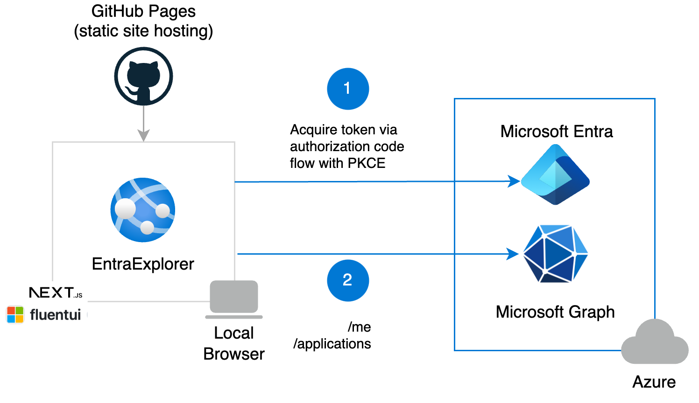

# Entra Explorer

Entra Explorer is an open-source solution that leverages Microsoft
Graph to help administrators retrieve and visualize data from
Microsoft Entra.

## Deprecated source, to be updated from react-spa-msal-entra-id-quickstart.

[Entra Explorer](https://www.entraexplorer.com)

## Updates

- All Application Registrations that include certificates and secrets.
- All Enterprise Applications with assigned application roles.
- All Enterprise Applications configured for SAML SSO, along with their expiration dates.

### 12-01-2025
- Application Registration analytics (creations)

## Solution Overview

The solution is a single-page application (SPA) hosted on GitHub Pages,
built with Next.js (a React framework) and styled using Microsoft&apos;s
Fluent UI. It leverages the Microsoft Authentication Library (MSAL) for
authentication, with all Microsoft Graph requests handled on the client
side.

<p align="center">
  
</p>

## Running your own instance of Entra Explorer

### Prerequisites

- [Node.js](https://nodejs.org/en/download/)
- [Next.js v14.2.16+](https://nextjs.org/docs/getting-started/installation)
- [Visual Studio Code](https://code.visualstudio.com/download)
- A modern web browser

- Open ./lib/msalConfig.ts in an editor.
- Replace ClientId and Authority for your created Entra Application Registration (Single-Page Application)

### Installing dependencies
```bash
# Install dependencies from the root of the repo
npm install
```
### Running the application
```bash
# Run locally
npm run dev

# Optionally build
npm run build
```

Open http://localhost:3000 to view in your browser.

---

Please note that Entra Explorer is not an official Microsoft product
and is in no way affiliated with, endorsed by, or sponsored by
Microsoft.

[LinkedIn - Chris Dymond](https://au.linkedin.com/in/chris-dymond)
